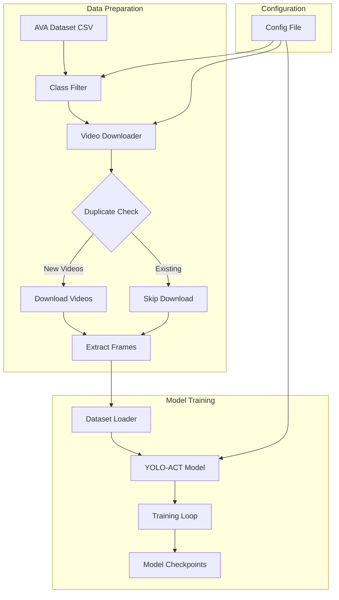

# YOLO-ACT Training Pipeline with AVA Dataset

## Project Overview

This is a complete pipeline to train the YOLO-ACT model (based on the research paper "YOLO-ACT: Real-time Action Detection") using the AVA dataset. The pipeline includes video downloading with class filtering, duplicate avoidance, and full model training.

## Architecture



## Pipeline Components

### 1. Project Structure
```
d:/Campus/
├── config/
│   ├── ava_classes.py          # AVA 80 class mappings
│   └── training_config.py       # Training hyperparameters
├── scripts/
│   ├── download_videos.py       # Video downloader with class filter
│   ├── check_existing.py        # Check for existing videos
│   ├── extract_frames.py        # Video to frame extraction
│   └── train_yolo_act.py        # Model training script
├── data/
│   ├── raw_videos/              # Downloaded videos
│   ├── frames/                  # Extracted frames
│   ├── train.csv                # Training annotations
│   └── val.csv                  # Validation annotations
├── models/
│   ├── yolo_act.py              # YOLO-ACT model definition
│   └── checkpoints/             # Saved model weights
├── pipeline.py                  # Main orchestration script
├── requirements.txt              # Python dependencies
└── README.md                     # Usage instructions
```

### 2. AVA Dataset Classes (Selected for User)
The following action classes will be used based on user request:
- kiss, hug, walk, run, sit, jump, fight, and related actions

### 3. Key Features

#### Video Downloader (`download_videos.py`)
- Downloads videos from YouTube using AVA dataset video IDs
- Filters videos by selected action classes
- Checks for existing videos to avoid duplicate downloads
- Uses yt-dlp for reliable video downloading
- Supports resume capability for interrupted downloads

#### Duplicate Check (`check_existing.py`)
- Scans existing video directory
- Compares with AVA dataset annotations
- Returns list of videos that need downloading
- Avoids re-downloading existing files

#### Frame Extraction (`extract_frames.py`)
- Extracts frames at specified FPS from videos
- Generates bounding box annotations
- Creates training/validation splits

#### Training Script (`train_yolo_act.py`)
- Implements YOLO-ACT architecture
- Supports transfer learning from pretrained weights
- Training with GPU acceleration
- Model checkpointing and logging

## Implementation Plan

### Step 1: Create Configuration Files
- AVA class mapping (80 classes)
- Training hyperparameters

### Step 2: Create Download Scripts
- Video downloader with YouTube support
- Duplicate check utility

### Step 3: Create Data Processing
- Frame extraction pipeline
- Annotation format conversion

### Step 4: Create Model & Training
- YOLO-ACT model implementation
- Training loop with validation

### Step 5: Create Pipeline Orchestration
- Main script to run entire pipeline
- Error handling and logging

## Dependencies

- Python 3.8+
- PyTorch 2.0+
- OpenCV
- yt-dlp (video downloading)
- pandas (data processing)
- albumentations (data augmentation)
- tensorboard (logging)

## Usage

```bash
# Install dependencies
pip install -r requirements.txt

# Run full pipeline
python pipeline.py --classes kiss,hug,walk,run,sit,jump,fight

# Or run individual steps
python scripts/download_videos.py --classes kiss,hug,walk,run
python scripts/extract_frames.py
python scripts/train_yolo_act.py --epochs 100
```
